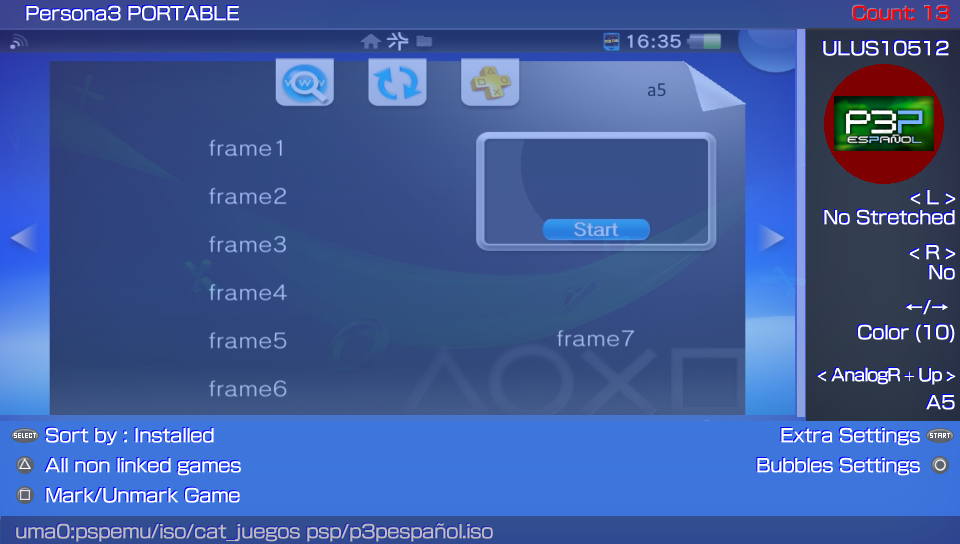
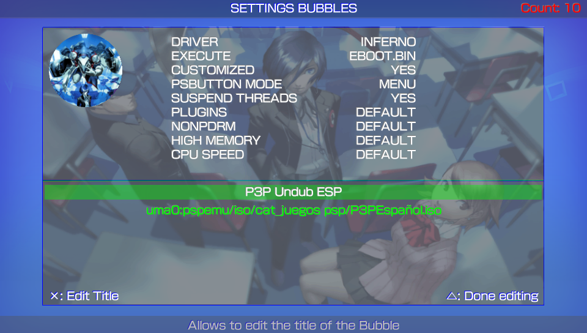
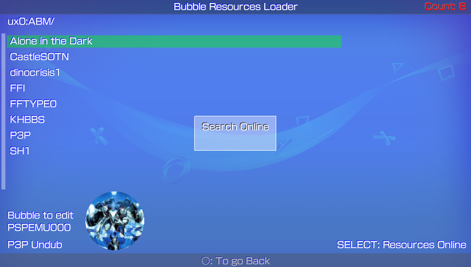
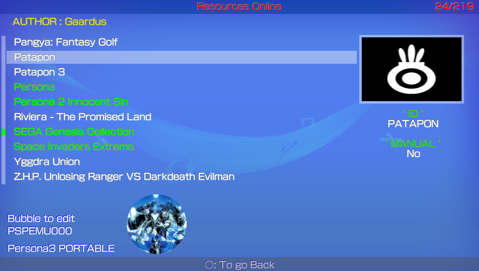

# Adrenaline Bubbles Manager
**Create and organize your direct adrenaline bubbles.**

### Description ###
This useful application allows you to make personalized bubbles with 'icon' and 'title' of your PSP content (HBS/PSX/ISO/CSO) quick and easy, using the 'LMAN' plugin, forgetting completely of the tedious and long manual method.

## IMPORTANT ##
**Adrenaline Bubbles Manager (ABM) purpose is to create the bubbles and necesary links to boot chosen psp iso/cso/pbp files with adrenaline v6.x through Lman's plugin adrbblbooter, all done within the ps vita, but, ABM does not change cpu speed, any issue related with that should be mentioned to Lman or the_flow**

### Adrenaline Version v7.0 ###
### Adrenaline Bubble Booter Version v1.3 ###
### Adrenaline Bubbles Manager Current Version: 6.19 ###

### Instructions ###
1. **Install Adrenaline v7.0**
Make sure Adrenaline works correctly, to be able to boot Adrenaline opening it just once, it is highly recommended to add the following line below the kernel line in ur0:tai/config.txt. 
*KERNEL 
ux0:app/PSPEMUCFW/sce_module/adrenaline_kernel.skprx

2. After taking care of step 1, then you can start using Adrenaline Bubbles Manager to create bubbles for your PSP/PSX content.

### NOTE (NoPspEmudrm) ###
For support with downloaded games (NoPspEmudrm) you must have installed the following plugins in adrenaline:
- *([Npdrm free mod](https://github.com/lusid1/npdrm_free_mod)).* 
- *([Np Loader mod](https://github.com/lusid1/nploader_mod)).* 

### Changelog 6.20 ###
- Correct support for adrenaline bubbles with boot.bin

### Changelog 6.19 ###
- Added option to download availabe languages. 
- Lastest ABM version is needed to be able to download newset resources for the repo Vita bubbles 

### Changelog 6.18 ###
- Added support for the new json format for downloading custom bubbles (preview.png) 
- Now the previews are downloaded one by one. (The first time will be a bit slow) 

### Changelog 6.17 ###
- Fixed bug that prevented the OSK from opening caused by CR (carriage return) on name input 
- Option to create bubbles using gameid of installed legit content has been disabled 

### Changelog 6.16 ###
- HotFix No games found 

### Changelog 6.15 ###
- Fixed glitch on boot.png images 
- When creating new bubbles the template style can be changed: PSPEMU, PS1EMU, PSMOBILE, A5 
- Option Restore Adrenaline v7 added to Extra settings 
- Added the ability to change the bubble's title for ABM previously created bubbles 

### NOTE: ###
Because a lot of PSP Homebrews have the same TitleID, the shotcuts of homebrew will be created like PSPEMUXXX. 

### Controls ###

**Adrenaline Bubbles Manager does recognize the accept/cancel buttons According to console region.**

## iso/cso/pbp content selection screen ##

*Creating Bubbles*

- **Triangle:** Batch Installation for non installed content. 
- **L:** To switch the way the bubble will look like in Livearea (original icon look/stretched icon look) 
- **R:** Select one of the available SetPacks: PSP/PSX or Default: 
		Select PSP or PSX to create the bubble using official PSP or PSX BG0 used for Ps Vita. 
		Select Default to create the bubble using the iso/cso/eboot resources. 
- **SELECT:** Sort List: Device, Install, GameId, Category. 
- **Left/Right:** To change the bubble background color for the selected content (when using original size not stretched icons, 17 available colors ). 
- **Square:** Multiple Selection. 
- **Start:** Open Extra Settings menu (set default bubble color, sort list, Adrenaline version check, Adrenaline Bubbles Manager version check). 
- **HOLD Analog Right UP + Up:** Press and hold Right Analog 'up' and press button 'up' to switch between template styles for selected bubble: PSPEMU, PS1EMU, PSMOBILE, A5 
- **X:** Create Bubbles. 
- **O:** Configurate/Edit Bubbles. 

*Extra Settings*

This option allows you to set some preferences as default for ABM such as:
- **BubbleID:** PSPEMUXXX or GAMEID. 
- **Convert 8bits:** Now you can disable the 8bit image conversion when creating or editing ABM bubbles. 
	You must be sure the images you are using are in compatible format, otherwise the bubble will fail. Default is YES. 

- **Default Sort:** Installed, Title, Date of modification, Category, GameID or Device. 
- **Default Color:** Select the default color for your bubbles (19 colores disponibles). 
- **Default BubbleName:** By Title, By File Name or Input the desired Name. 
- **Set Template:** Select the template style: PSPEMU, PS1EMU, PSMOBILE, A5. 
- **ABM Update:** Checks for ABM Updates at start, default is YES. 
- **Check Adrenaline:** Checks for Adrenaline Updates, set to NO if you want to stay in Adrenaline's installed version. 
- **Set Language:** Allows to load selected language at start in ABM: English or Custom. 
- **Restore Adrenaline v7**: Reinstall Official Adrenaline v7. 

### NOTE: ###
**If your Adrenaline.vpk gets updated online to a higher version used by ABM, then you'll have to disable this option
to avoid reinstalling the adrbblbooter plugins to the PSPEMUCFW folder everytime you open ABM.**

## Bubble edit screen ##

*Editing Bubbles*

**Triangle:** Allows to edit the configuration file boot.inf 
-	Change driver: "INFERNO", "MARCH33", "NP9660" 
-	Changes the .bin booting mode: "EBOOT.BIN", "BOOT.BIN", "EBOOT.OLD" 
-	Customized: To let each bubble have its own settings keep it in YES
-	PS button Mode: Menu, Livearea, Standard
-	Suspend game: Stop the game running on the psp when PS button is pressed. 
-	Disable/Enable plugins: "ENABLE", "DISABLE" 
-	NonpDRM Engine: Load content using Quickrazor's plugin. 
-	High Memory: Force high memory layout. (Disabled for GTA Native Resolution Patch) 
-	Change game cpu clock speed: Improves loading speed and game response depending of chosen speed. 

In case you move your games to a diferent partition from where the bubble was created, the game path can be edited (will be highlighted in yellow). 
The bubble's title can be edited too. 

*Uninstall Bubbles*
- Press SELECT (single) or START (all) to select bubbles you wish to uninstall.
- Square: To uninstall the selected bubbles.

## Inject images and manual to ABM bubbles ##

This option allows you to Insert your desired images to the selected bubble, this will improve the looks of your bubbles in Livearea.

To use this feature you have to follow the instructions below: 
1. Create a folder with the same name of your game (highly recommended but not a must), once you have created/downloaded the images and/or game manual to inject, place them into that folder, then, copy/paste said folder to ux0:ABM. 

2. Download or create the images to insert, those images to use have to be renamed and resized to: 
- icon0.png			 128x128 
- startup.png		 280x158 (max)    
- pic0.png			 960x544    
- bg0.png			   840x500 
- boot.png			 480x272 (32bits or 24 bits) <Optional> 
- template.xml	 <Optional> 
- Manual			   images inside (001.png, 002.png 960x544) <Optional> 
3. Now is possible inject the Manual folder with your manual's images inside (001.png, 002.png 960x544). The folder of the Manual must be place in the following path ux0:ABM/(Gameid)/ 
4. Copy/paste your newly created folder with the images inside to the path ux0:ABM/ 

### NOTE: ###
Make sure the images are renamed as mentioned above and to be in png format, also make sure the images are resized to corresponding sizes mentioned avobe (if your images sizes are close to specs they will work too). 
You can add your own template.xml file. (Make sure the images names are the same to images linked in the template.xml).

To insert new images to any selected bubble, when you are in the Edit Bubble menu: 
- **X:** To open images folder list. 

In images folder list:
- **X:** To choose the folder where you have the images to insert (preview of the images will be shown). 
- **O:** To go back. 

After choosing a folder, when you can see the images previews: 
- **O:** To go back. 
- **START:** Insert the previewed images to chosen bubble. 

## Resources Online ##
Press SELECT in the Inyector of Images option to install incredibles Online Resources created by the community for all of us.

### Credits ###
- eCFW Adrenaline By TheFloW.
- Adrenaline Bubble Booter By LMAN 'leecherman'
- startup.png By Freakler.
- Testers @_Falaschi_, @baltazarregala4.
- Translator @Z3R0N3__.
- Some graphics By WZ-JK.

## Donation ##
In case you want to support the work of the team on the vita, you can always donate for some coffee. Any amount is highly appreciated:

