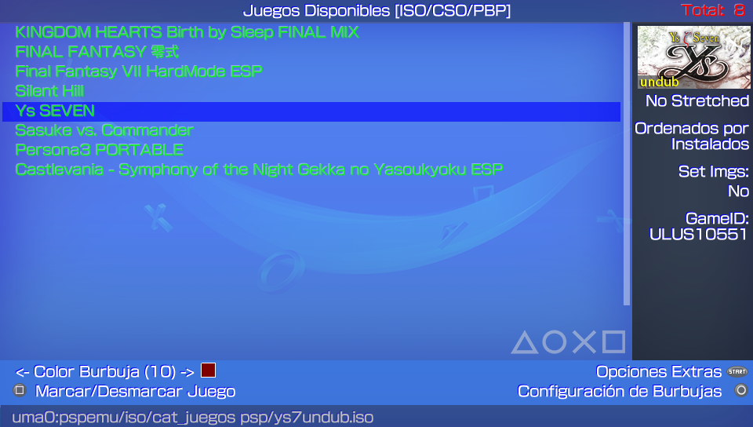
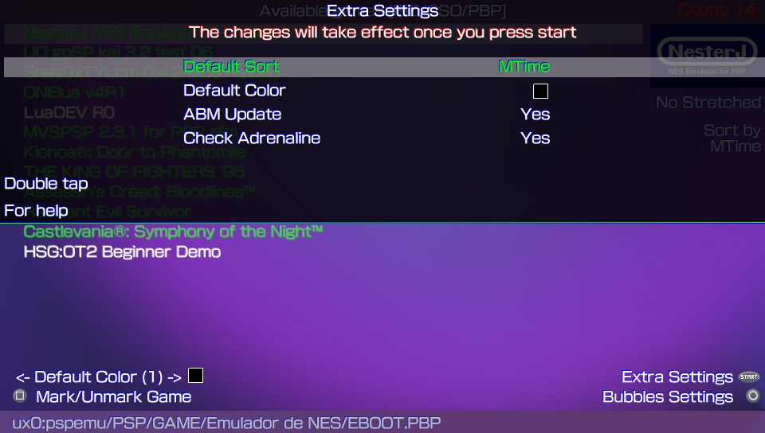
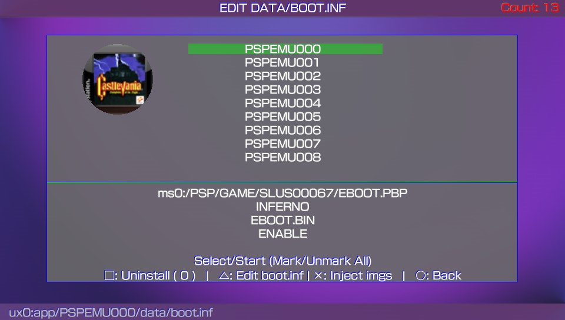
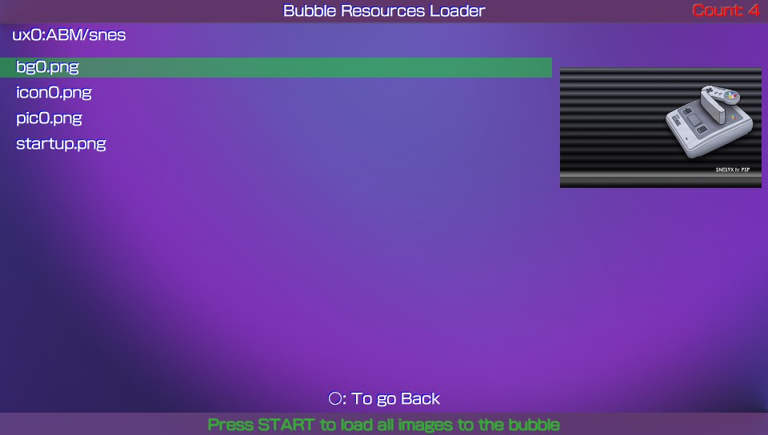

# Adrenaline Bubbles Manager
**Create and organize your direct adrenaline bubbles.**

### Description ###
This useful application allows you to make personalized bubbles with 'icon' and 'title' of your PSP content (HBS/PSX/ISO/CSO) quick and easy, using the 'LMAN' plugin, forgetting completely of the tedious and long manual method.

## IMPORTANT ##
**Adrenaline Bubbles Manager (ABM) purpose is to create the bubbles and necesary links to boot chosen psp iso/cso/pbp files with adrenaline v6.x through Lman's plugin adrbblbooter, all done within the ps vita, but, ABM does not change cpu speed, any issue related with that should be mentioned to Lman or the_flow**

### Adrenaline Version v6.9 ###
### Adrenaline Bubble Booter Version v1.1 ###
### Adrenaline Bubbles Manager Current Version: 6.00 ###

### Instructions ###
1. **Install Adrenaline v6.9**
Make sure Adrenaline works correctly, to be able to boot Adrenaline opening it just once, it is highly recommended to add the following line below the kernel line in ur0:tai/config.txt. 
*KERNEL 
ux0:app/PSPEMUCFW/sce_module/adrenaline_kernel.skprx

2. After taking care of step 1, then you can start using Adrenaline Bubbles Manager to create bubbles for your PSP/PSX content.

### Changelog 6.00 ###
- Added option to inject only the game's Manual. 

### Changelog 5.30 ###
- Fixed error when creating multi-bubbles, now each bubble gets its own name. 

### Changelog 5.27 ###
- Added an option to use the filename ("example".iso) to rename bubbles made with ABM. 
- Added compatibility with Adrenaline Bubble Booter v1.1. 

### Changelog 5.26 ###
- Fix typo in spanish.txt. 

### Changelog 5.25 ###
- Added option Lmans new customizable options such as: 
	"Suspend game" Stop the game running on the psp when PS button is pressed. 
	"Enable/Disable Plugins" very self explainatory. 
	"NonpDRM Engine" Load content using Quickrazor's plugin. 
	"High Memory" Force high memory layout. (Disabled for GTA Native Resolution Patch) 
	"Change game cpu clock speed" Improves loading speed and game response depending of chosen speed. 
- Allows to load selected language at start: English or Custom", loads chosen language if set as default (ABM only not bubbles). 
- For Adrbubblebooter changelog visit its website [AdrBooterv1.0](https://sites.google.com/site/theleecherman/adrbubblebooter/vpkedition)

### Changelog 5.24 ###
- Added compatibility with adrenaline 6.9 thanks to LMAN. 
- For Adrbubblebooter changelog visit its website [AdrBooterv1.0](https://sites.google.com/site/theleecherman/adrbubblebooter/vpkedition)

### Changelog 5.23 ###
- Now Manual folder is detected at resources injection option. 
- Download Manual option added to online resources injection. 
- Vitabubbles repo updated with lots of new resources. 

### Changelog 5.22 ###
- Fixed template.xml and framesXX.png when injecting images. 
- Added option to inject game Manual to bubbles. 

### Changelog 5.21 ###
- Added Bubble fix option to START menu for fixing bubbles asking to install adrbblbooter on every boot. 
- Fix menucolor.bin. 
- Added FullBubble-Non Streched in inject resources. 

### Changelog 5.20 ###
- Added PS button option to Extra Settings menu. 
- Added PS button option to Edit Bubble Settings menu. 
- Added description for the options in Edit Bubble menu. 
- Now you can set an image as boot.png again and inject the desired image, should be 480*272. 

### Changelog 5.19 ###
- Added compatibility with adrenaline 6.8 thanks to LMAN. 
- For Adrbubblebooter changelog visit its website [AdrBooterv0.9](https://sites.google.com/site/theleecherman/adrbubblebooter/vpkedition)

### Changelog 5.18 ###
- Now the preview images look more like ABM made bubbles when switching from full to non stretched option with L button. 
- Now the preview icons download is done by threads in function Online Resources. 

### Changelog 5.17 ###
- Added option to download resources and inject them un the desired ABM bubble. 

### Changelog 5.16 ###
- Re-add edit bubble path. Only when the path to the game does not exist 

### Changelog 5.15 ###
- Removed option show pic with triangle button. 
- Added Batch Installation Option by pressing triangle button for non installed content. 
- Now you can uninstall non linked bubbles per batch. 

### Changelog 5.14 ###
- Use Default Title option added to Submenu (START) enable it to skip the renaming process. 
- Now when creating 2 or more bubbles you'll have to rename all the bubbles before the creating process begins. 

### Changelog 5.13 ###
- Now you can select the SetPack for each bubble. Press R on the selected game. 
- Fixed error with the STITLE when creating bubbles (max length 52). 

### Changelog 5.12 ###
- Added PSP/PSX image set for bubble creation. 
- Added option description at submenu. 
- Added Adrenaline customized option enable/disable to ABM submenu. 
- Added a new bubble color similar to original PSP/PSX bubbles. 
- Added chinese support (download font from github repo and place at ux0:data/ABM/font) 

### Changelog 5.11 ###
- Compatible with Adrenaline v6.7 and Adrenaline Bubble Booter v.08 

### Changelog 5.10 ###
- Fixed reboot error (reboot loop). :(  

### Changelog 5.09 ###
- Fix support for iso/cso/pbp in xmc0. 
- Sort by Device (ux0,ur0,uma0, imc0, xmc0). 

### Changelog 5.08 ###
- Now ABM scans and shows PSP/PSX original games, but qwikrazor87's plugin is needed (npdrm_free.prx).
- Compatible with Adrenaline v6.6 and Adrenaline Bubble Booter v.07 
- Added support for iso/cso/pbp in xmc0 (Use Vitashell for mount xmc0). 
- Fix "startup.png" images 
- Support added for frameX.png images (with X from 1 to 5). 
- Sort by ID. 
- Light aesthetic changes and clean up code. 

### Changelog 5.07 ###
- Fix error C2-12828-1 on ABM bubbles. 
- Added Auto Repair boot.bin option on the START button submenu (changes the customized option to YES on the old Bubbles from ABM 5.04). 
- Now the bg0.png is shown at Bubbles Edit screen. 

### Changelog 5.06 ###
- Fixed reboot error (reboot loop). 

### Changelog 5.05 ###
- Compatible with Adrenaline v6.4 and Adrenaline Bubble Booter v.06 
- Auto-Conversion of boot.inf files to boot.bin files needed for ABB v.06 
- In the Edit Bubble Screen this are the available combinations: 
- Driver (INFERNO/MARCH33/NP9660). 
- Execute (EBOOT.BIN/EBOOT.OLD/BOOT.BIN). 
- Customized: (YES/NO). 
- Now when showing the bubble's linked game path will be highlighted green if the content is found, if not found will be highlighted orange. 
- *NOTE: If the game linked to your bubble is not there anymore the bubble will open Adrenaline or throw an error. 

### Changelog 5.04 ###
- Now you can disable the 8bit image conversion when creating or editing ABM bubbles. 
*NOTE: You must be sure the images you are using are in compatible format, otherwise the bubble will fail. Enter the submenu to change this settings with start. 
- Some changes in the list of Inject Images. 

### Changelog 5.03 ###
- New option to set default pic0 and bg0 images and your own xml file for your bubbles (up to 5 sets provided by you: ux0:ABM/Set1 to ux0:ABM/Set5). 
- New option to sort: Category. 

### Changelog 5.02 ###
- Fixed data.inf error. 
- Added config.bin on each bubble (adrenaline boot screen disabled). 
- New graphics by Wz-Jk. 

### Changelog 5.01 ###
- Compatible with Adrenaline v6.3 thanks to Lman. 
- Added npdrmfree enable/disable option to ABM bubble edit screen. 
- Added ux0:data/ABM/crc.ini to detect the CRC32 of the skprx modules. 

**NOTE:** With lman plugins update, now every bubble saves its own adrenaline configs if you like to disable adrenaline boot screen you have to do that for every bubble. 

### Changelog 5.00 ###
- Added submenu for Extra Setting. 
- Added hability to inject images to ABM bubbles. 

### Controls ###

**Adrenaline Bubbles Manager does recognize the accept/cancel buttons According to console region.**

## iso/cso/pbp content selection screen ##

*Creating Bubbles*

- **Triangle:** Batch Installation for non installed content. 
- **L:** To switch the way the bubble will look like in Livearea (original icon look/stretched icon look) 
- **R:** Select the SetPack for each bubble. 
- **Select:** Sort List: Device, Install, GameId, Category. 
- **Left/Right:** To change the bubble background color for the selected content (when using original size not stretched icons, 17 available colors ). 
- **Square:** Multiple Selection. 
- **Start:** Open Extra Settings menu (set default bubble color, sort list, Adrenaline version check, Adrenaline Bubbles Manager version check). 
- **X:** Create Bubbles. 
- **O:** Configurate/Edit Bubbles. 

*Extra Settings*

This option allows you to set some preferences as default for ABM such as:
- Now you can disable the 8bit image conversion when creating or editing ABM bubbles. 
	You must be sure the images you are using are in compatible format, otherwise the bubble will fail. Enter the submenu to change this settings with start.
- Set Imgs: Set1 to Set5, or Set PSP/PSX. 	
- Set sort list of your iso/cso/pbp. 
- Select the default color for your bubbles. 
- Enable/Disable ABM updates. 
- Adrenaline version check. 
	This option disables/enables ABM to check the Adrenaline version you have installed in your ps vita.
- Default Title Enable it to skip the renaming process. 	

### NOTE: ###
**If your Adrenaline.vpk gets updated online to a higher version used by ABM, then you'll have to disable this option
to avoid reinstalling the adrbblbooter plugins to the PSPEMUCFW folder everytime you open ABM.**

## Bubble edit screen ##

*Editing Bubbles*

**Triangle:** Allows to edit the configuration file boot.inf 
	Change driver: "INFERNO", "MARCH33", "NP9660" 
	Changes the .bin booting mode: "EBOOT.BIN", "BOOT.BIN", "EBOOT.OLD" 
	Disable/Enable plugins: "ENABLE", "DISABLE" 
	Disable/Enable npdrmfree: "ENABLE", "DISABLE" 

*Uninstall Bubbles*
- Press select (single) or start (all) to select bubbles you wish to uninstall.
- Square: To uninstall the selected bubbles.

## Inject images and manual to ABM bubbles ##

This option allows you to Insert your desired images to the selected bubble, this will improve the looks of your bubbles in Livearea.

To use this feature you have to follow the instructions below: 
1. Download or create the images to insert, those images to use have to be renamed and resized to: 
- icon0.png			128x128 
- startup.png		280x158 (max)    
- pic0.png			960x544    
- bg0.png			840x500 
- boot.png			480x272 
2. Create a new folder, rename to anything you want, recommended to use your game name, inside this folder place the images created in step 1. 
3. Now is possible ti inject the Manual folder with your manual's images inside (001.png, 002.png 960x544). The folder of the Manual must be place in the following path ux0:ABM/(Gameid)/ 
4. Copy/paste your newly created folder with the images inside to the path ux0:ABM/ 

### NOTE: ###
Make sure the images are renamed as mentioned above and to be in png format, also make sure the images are resized to corresponding sizes mentioned avobe (if your images sizes are close to specs they will work too). 
You can add your own template.xml file. (Make sure the images names are the same to images linked in the template.xml).

To insert new images to any selected bubble, when you are in the Edit Bubble menu: 
- **X:** To open images folder list. 

In images folder list:
- **X:** To choose the folder where you have the images to insert (preview of the images will be shown). 
- **O:** To go back. 

After choosing a folder, when you can see the images previews: 
-- **O:** To go back. 
- **START:** Insert the previewed images to chosen bubble. 

### Credits ###
- eCFW Adrenaline By TheFloW.
- Adrenaline Bubble Booter By LMAN 'leecherman'
- startup.png By Freakler.
- Testers @_Falaschi_, @baltazarregala4.
- Some graphics By WZ-JK.

## Donation ##
In case you want to support the work of the team on the vita, you can always donate for some coffee. Any amount is highly appreciated:

