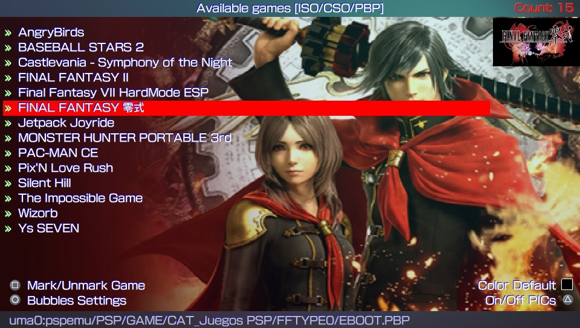
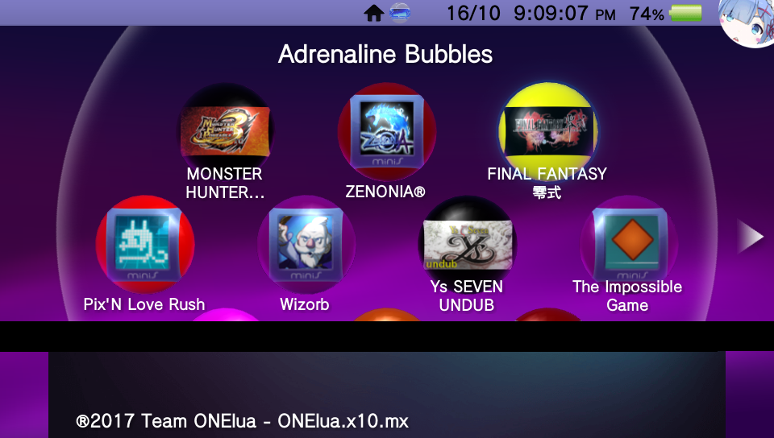
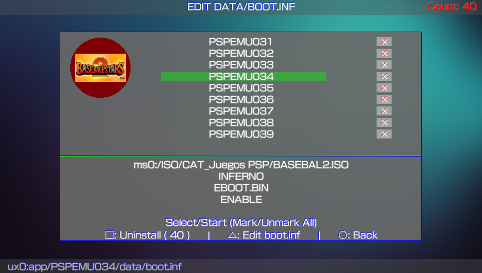
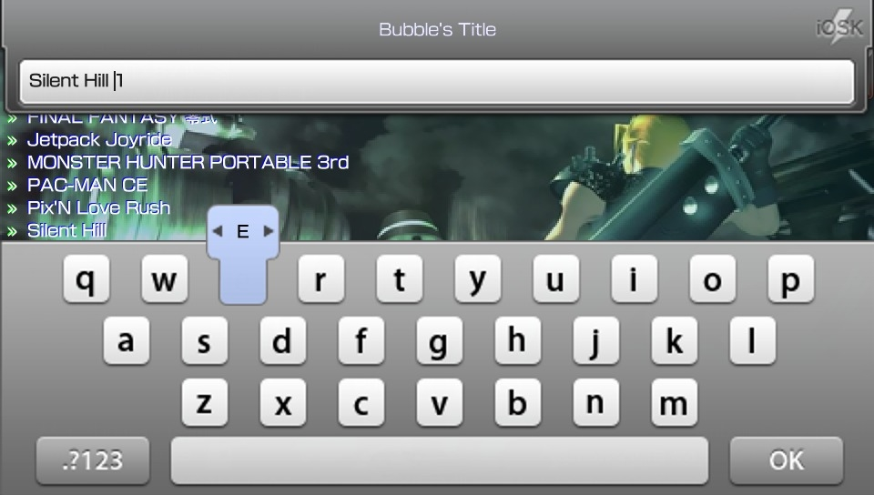
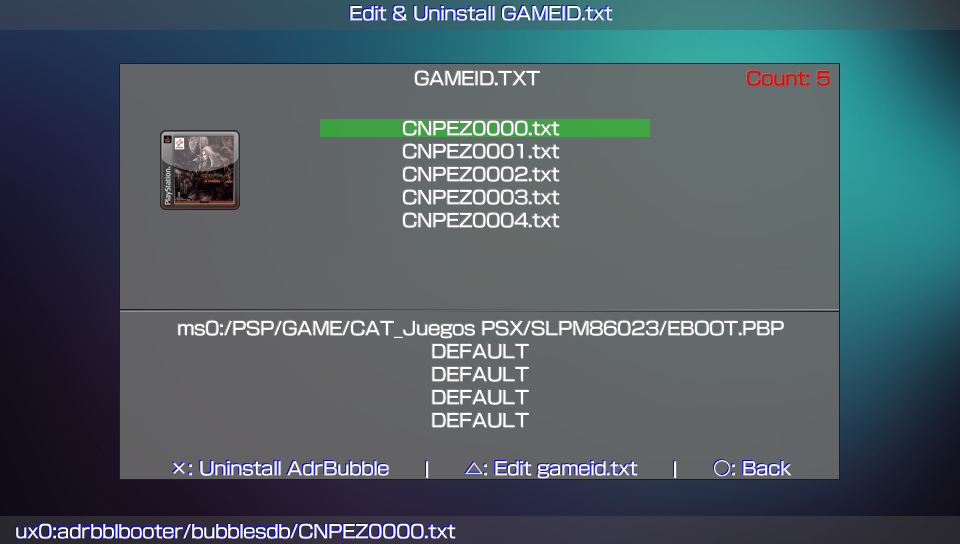
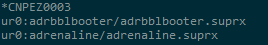
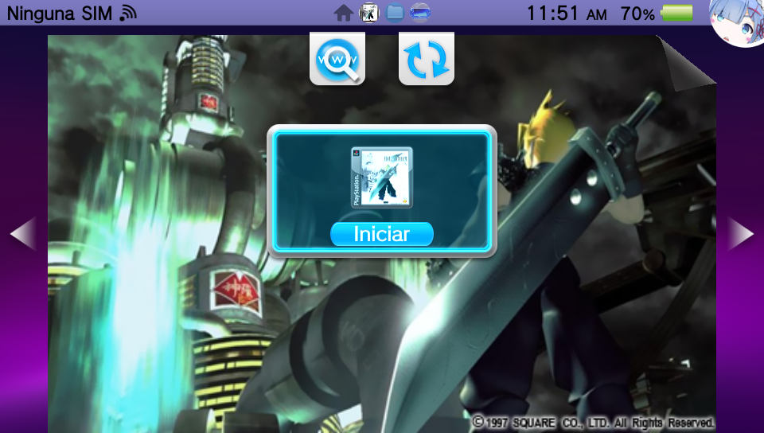

# Adrenaline Bubbles Manager
**Create and organize your direct adrenaline bubbles.**

### Description ###
This useful application allows you to make personalized bubbles with 'icon' and 'title' of your PSP content (HBS/PSX/ISO/CSO) quick and easy, using the 'LMAN' plugin, forgetting completely of the tedious and long manual method.

## IMPORTANT ##
**Adrenaline Bubbles Manager (ABM) purpose is to create the bubbles and necesary links to boot chosen psp iso/cso/pbp files with adrenaline v6.x through Lman's plugin adrbblbooter, all done within the ps vita, but, ABM does not change cpu speed, any issue related with that should be mentioned to Lman or the_flow**

### Changelog 4.05 ###
- Now you can Sort your iso/cso/pbp by Title or by Date of Modification pressing SELECT. 
- Pressing START in the iso/cso/pbp list will display the basic controls. 
- Now the Bubble icons in the "EDIT DATA/BOOT.INF" section are loaded "on the fly". 
- Please update your translations...New lines were added. 

### Changelog 4.04 ###
- Added japanese letters support for game titles with Sony's OSK. 

### Changelog 4.03 ###
- Fixed error with Homebrews with odd icons, forcing the img to 8bits. 
- Fixed empty iso/cso/pbp list error (Press R) again!!!. 
** Changes thanks to 1upus: **
- Autodetect System language and loads translation if found. 
- Translations moved to resources/lang and renamed to .txt 
- Use english_us.txt as default translation. 
- Automatic creation of translation sample on ux0:data/ABM/lang/english_us.txt. 
- Loading translation from ux0:data/ABM/lang/%language%.txt (if exists). 
- Loading custom ttf font from ux0:data/ABM/resources/%language%.ttf (if exists)
- Some missed strings added to langpack (updater, custom message etc.). 
- Some lua scripts and translation optimization. 

### Changelog 4.02 ###
- Fixed empty iso/cso/pbp list error. 
- Now you can select to resize the games icons to show in Full Bubble or keep the original psp looks (no stretched icons). 
- Press L or R to switch between full or no stretched icons for your bubbles. 
- The script lang.lua got modified, so please update your translation. 

### Changelog 4.01 ###
- Support to load your own font.ttf (Must be placed in ux0:data/ABM/font.ttf). 
- Now you can translate ABM, you have to translate only the texts in quotation marks of the "system/lang.lua" script found in ABM and place the translation in ux0:data/ABM/lang.lua). 
- Now change the background color of each bubble is individual (Press left/right to change the color). 

### Changelog 4.00 ###
- Fixed error which didn't allow to install more than 30 bubbles. 
- Now when multi-installing more than 9 bubbles a custom keyboard will open after 10th bubble. 
- Now the PS button will be blocked when Getting Resources and Instaling Bubble. 
- Now you can select the bubble background color!!! (Press left/right to change the color. 17 available colors). 
- Removed more popup messages...again!!!. 
- Thanks ZeroZelta and Dovemac for the iosk keyboard and DevDavis for the port a Psvita. 

### Changelog 3.10 ###
- Fixed error caused with iso/cso/pbp which didn't have icons... again!!!. 
- Light aesthetic changes for icons when shown in the lists. 

### Changelog 3.09 ###
- Added support for iso/cso/pbp in imc0 (Use Vitashell for mount imc0).
Thanks to ([Namikaze Ruisu](https://twitter.com/Vatomalo_)). 

### Changelog 3.08 ###
- New option to single or multi uninstall  PSPEMU bubbles. 
- Now the bubble's icons are not stretched and look a lot beter. 
- Now you can do multi-bubble installation. 
- Ps Button can be pushed to exit ABM. 
- Cleaned up the code a bit and more popup messages were removed. 

### Changelog 3.07 ###
- Fixed crash while trying to load some functions.
- Removed some popup messages.

### Changelog 3.06 ###
- Now the resources (images) for the new bubble are converted to 8bits, so dont worry aboud db rebuild. 
- Support for Old ABM version has been removed. 
- Removed restart after creating bubbles. 
- NOTE: If the iso/cso/hb to launch lacks of icon0.png or pic1.png then ABM will use included Lmans images. 

### Changelog 3.05 ###
- Added compatibility with Adrenaline v6 and Lmans adrbubblebooter plugin for adrenaline v6.
- On this version ABM searches for the installed Adrenaline version and adapts to work with found Adrenaline version (either v6 or v5 and lower).
- Added the option to change the boot.inf driver setup.
- Added the option to use pic1.png to show as pic0.png and bg0.png, and to set icon0.png from iso/cso/hb to be shown in the bubble and as startup.png (changes will revert after a db rebuild and default Lmans plugin images will be shown).
- Added the option Bubble Restore to compensate the loss of the iso/cso/hb images from the bubbles after a db rebuild (to use this option ABM opens the selected bubble, but you have to return manually to ABM).
- NOTE: if you choose no, the ps vita will restart so the changes on the images take effect.
- Although, the icon/pic changes are not permanent (the icon/pic will go back to Lman's black images after a db rebuild/update), to - compensate that, an option to restore the bubbles has been added.

### NOTE: ###
To use Adrenaline Bubbles Manager (ABM) v3.05 and up you must have Adrenaline v6 (vpk version) installed and working.
ABM has nothing to do with game incompatibility or booting errors such as black screen after booting a game or booting to Adrenaline since ABM only installs Lmans plugin and creates the direct access bubbles, for those issues you have to try different driver setup and booter which you can change in ABM by pressing circle and then triangle over the choosen bubble.
For the rest of it we hope you find ABM usefull

### OLD VERSION (Adrenaline 5.1) ###

### Changelog 3.01 ###

- If adrenaline folder is found at ur0: then ABM will add corresponding lines to ur0:tai/config.txt, otherwise the lines will be added to ux0:tai/config.txt i adrenaline folder is found at ux0: 

### Instructions ###
The initial interface is composed by the list of available PSP content to launch (HBS/PSX/ISO/CSO), get positioned over the desired content using the D-pad and press X on the desired game to proceed to select the bubble that will launch it, a popup window will show you all the bubbles available to use (PSP GAME), you only have to position yourself on the desired one and press X, to begin the linking process, this app will tell you if there is an installed pboot and if you want to change it and continue, then the app will ask you if the STARTDAT should be disabled, you will also be asked if you want to change the Name the bubble or use that of the content to link, and finally you will be asked to restart the console to update the database.
Note: This app will allow you to personalize more than one bubble at a time.

### Changelog 3.00 ###
- In this version the eboot.pbp generates  while the icon.dds get set, all in one step.
- Adrbblbooter plugin files updated to newest version (v0.5) Thks LMAN leecherman.
- adrbblbooter folder must be moved to ur0, and corresponding lines with especific paths must be added to ur0:tai/config.txt
- Added support for iso/cso/pbp in uma0 (Use a compiled version of Adrenaline that supports uma0 partition ([Adrenaline uma0 commit 0f8e709](https://sites.google.com/site/theleecherman/adrbubblebooter/Adrenaline-0f8e709.rar?attredirects=0)) Thks LMAN.
- To be able to use adrenaline on the memory card or the msd with sd2vita adapter, adrenaline folder must be moved to ur0, and corresponding lines with especific paths must be added to ur0:tai/config.txt
- Now options for PLUGINS and STARTDAT.PNG is Enable for default.
- Added option to Enable/Disable plugins when linking content to a bubble.
- Added option Edit GAMEID.txt within ABM for Custom Bubbles (no need to restart):

        1. Path to the iso/cso/pbp file.
        2. UMD driver (INFERNO\MARCH33).
        3. Execute Boot (EBOOT.BIN\EBOOT.OLD\BOOT.BIN).
        4. Plugins state (ENABLE\DISABLE).
        5. STARTDAT.PNG state (ENABLE\DISABLE).
      
- Removed adrbblbooter_nostartdat.suprx.

### NOTE ###
Remember to change adrbblbooter plugin path for isos already linked on config.txt

It should be:

*GAMEID

ur0:adrbblbooter/adrbblbooter.suprx

### Changelog 2.1 ###
- Now you can press [] to **install M33 driver** from start screen (for iso/cso files only).
- NEW OPTION ICON0.DDS: Added the option to use **pic1.png** to show as **bg0.png**, and to set icon.dds to be shown in full bubble (but, to use this feature, te game must have been booted once and changes will revert after a db rebuild).
- More Code got cleaned up a bit.

### MARCH33 driver ###
- Usage of M33 driver + EBOOT.OLD (prometheus) is recommended on following situations:

  For PSP content which go pass the startdat but stay in black screen. I'll mention PE 3rd birthday as an example.

  For all PSP minis.
- For PSP content which still won't go beyond the black screen you should contact Leecherman or wait for his next update. 

### Controls ###
- Up/Down: Browse the list of PSP content(HB/ISO/CSO) or Browse the list of bubbles to boot.
- Cross: Select content and go to bubble selection or select bubble and create your access.
- Square: Select content to install M33 driver from start screen (for iso/cso files only).
- Circle: Go to previous section.
- Triangle: enable/disable view of 'PIC1'.
- Start: Go to livearea.

## Extras ##
- Cross: Make PBOOT.PBP
    *Inserts a title and icon0 to be shown in livearea to Adrenaline's pboot.*
- Circle: Make ICON0.DDS
    *Resizes the icon.dds to full bubble and sets the  pic1 as bg0 for the chosen bubble. (Changes get reverted with db update)*
  

As an advice, you must create the custom bubble's PBoots first, after that, you can use the option ICON0.DDS for a complete bubble customization.

### Changelog 2.0 ###
- Adrbblbooter plugin files updated to newest version (v0.4).
- Added the option to use selected content's pic1 as STARTDAT.PNG if found, otherwise Lman's plugin default STARTDAT.PNG will be used.
- Now the function Disable Adrbblbooter Bubbles allows to:

        1. Eliminate the GAMEID.TXT and corresponding STARTDAT.png files from path "ux0:adrbblbooter/bubblesdb/".

        2. Eliminate corresponding lines from ux0:tai/config.txt and reload config

        3. Eliminate the PBOOT.PBP from chosen bubble.

- Code got cleaned up a bit.
- Some stetic changes.

Extras.
- Cross: Add M33 line to GAMEID.txt on screen message.
On small popup window (to add corresponding lines to GAMEID.TXT).
- Cross: BOOT.BIN for M33 driver only.
- Triangle: EBOOT.OLD FOR M33 DRIVER + Prometheus ISO loader.
- Circle: Cancel.

### Changelog 1.0 ###
- Initial release 'POC'.
- Added automatic network update. app will now notify you when there's a new update.
- Support get and view complete list of content of PSPemu.
- Added option enable/disable view of 'PIC1'.

### Credits ###
- Adrenaline Bubble Booter By LMAN 'leecherman'
- eCFW Adrenaline By TheFloW.
- PBOOT icon and livearea icon By Freakler.
- Testers @_Falaschi_, @baltazarregala4.
- Some graphics By WZ-JK.

## Donation ##
In case you want to support the work of the team on the vita, you can always donate for some coffee. Any amount is highly appreciated:

